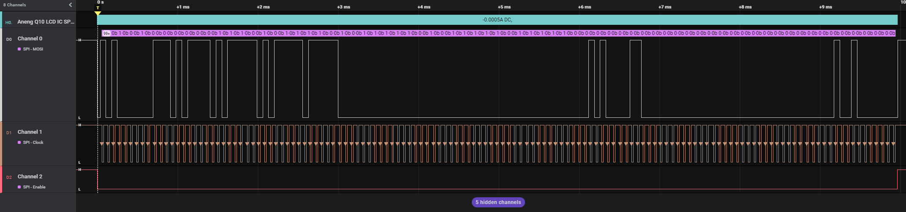

# Aneng Q10 / Zoyi/Zotek ZTY LCD Driver SPI Analyzer

Quickly hacked together High-level analyzer for Saleae Logic to decode the SPI traffic between the DTM0660L and the unmarked LCD driver IC in the Zoyi/Zotek ZTY, Aneng Q10 and other rebranded meters of the same type.  
Normally the DTM0660L has a UART/RS232 interface, but on this meter the manufacturer botched it and repurposed the TX pin for the front button matrix.  
Analyzer code is pretty much a hacked together variant of the "[SPI Transaction Framer](https://github.com/jonathangjertsen/SpiTransactionFramer)" extension; Note, I'm not a python guy and just got a logic analyzer a few days ago out of necessity for my [DMM-ESP8266-Datalogger](https://github.com/Rejdukien/DMM-ESP8266-Datalogger) project.

Supports Voltage AC/DC, Current AC/DC, Resistance, Temperature.  
  
## Getting started

1. Hook up pins as depicted in the annotated image down below
2. Set SPI decoder to 1 bit per transfer, CPOL = 1, CPHA = 0
3. Run this decoder

